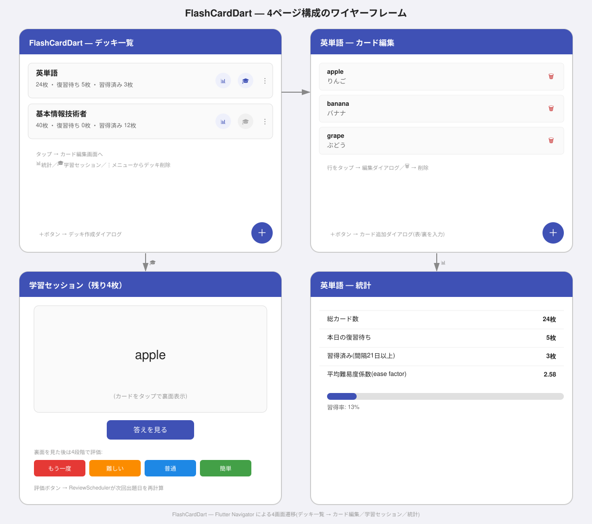
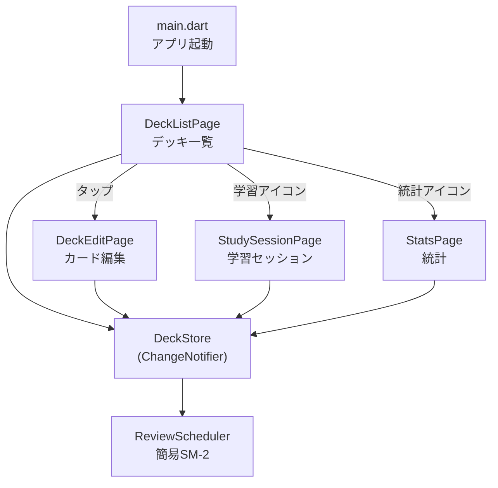
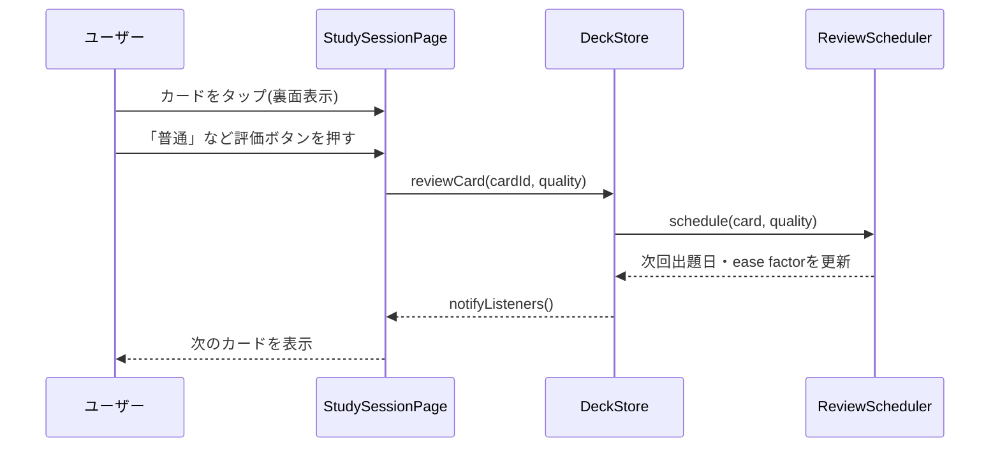
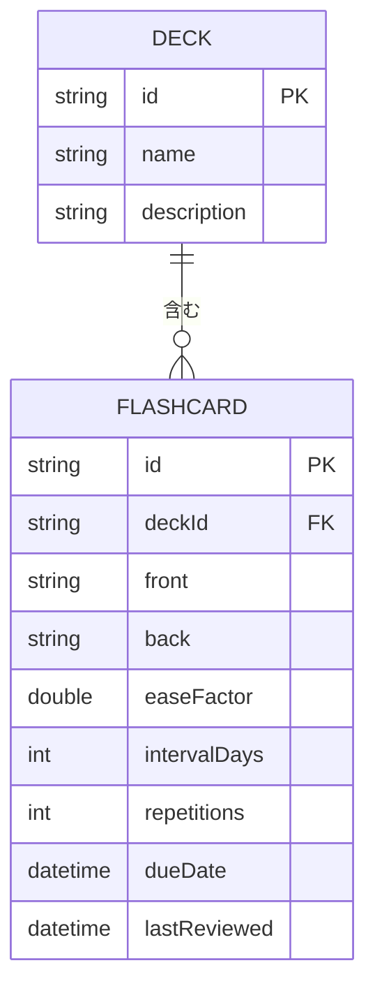

# FlashCardDart 

Flutterで動く、間隔反復（スペースドリピティション）方式のフラッシュカード学習アプリ。


## 目次

* [概要](#概要)
* [特徴（主な機能）](#特徴主な機能)
* [想定ユーザー（ペルソナ）](#想定ユーザーペルソナ)
* [UIイメージ](#uiイメージ)
* [技術スタック](#技術スタック)
* [システム構成図](#システム構成図)
* [データ構造](#データ構造)
* [セットアップ](#セットアップ)
* [スケジューリングアルゴリズム](#スケジューリングアルゴリズム)
* [今後の展望](#今後の展望)

## 概要

FlashCardDartは、デッキ（単語帳）を作り、フラッシュカードを登録し、間隔反復方式で復習していく学習アプリです。これまでのCLIツール群と異なり、Flutterによる4画面構成のGUIアプリとして作っています。

外部パッケージは最小限（Flutter SDK本体と`flutter_lints`のみ）にとどめ、状態管理も`provider`のような追加パッケージを使わず、Flutter標準の`ChangeNotifier`と`ListenableBuilder`だけで完結させています。復習スケジューリングには、Ankiでも採用されている簡易版SM-2アルゴリズムを自前実装しています。

## 特徴（主な機能）

- デッキ（単語帳）の作成・削除
- フラッシュカード（表・裏）の追加・編集・削除
- タップでカードを裏返す学習セッション、4段階評価（もう一度／難しい／普通／簡単）による復習
- 簡易SM-2アルゴリズムによる次回出題日の自動計算
- デッキごとの統計（総カード数・本日の復習待ち・習得済み枚数・平均難易度係数）表示
- 4ページをFlutter Navigatorで行き来する画面遷移

## 想定ユーザー（ペルソナ）

英単語や資格試験の暗記カードをスマホ・PCで効率よく復習したい学習者を想定しています。紙の単語帳やAnkiのような専用アプリほど高機能でなくても、自分でカードを作ってその場で復習サイクルを回せれば十分、という人に向いています。画像・音声付きカードやクラウド同期など、本格的な暗記アプリの全機能を再現することは対象外です。

## UIイメージ



デッキ一覧 → カード編集／学習セッション／統計、という4画面の遷移関係を示したワイヤーフレームです。実際のアプリでも同じ4画面がこの構成で遷移します。

## 技術スタック

| 分類 | 技術 |
| --- | --- |
| 言語 | Dart 3.x |
| UIフレームワーク | Flutter（Material 3） |
| 状態管理 | Flutter標準の`ChangeNotifier` / `ListenableBuilder`（追加パッケージなし） |
| テスト | `flutter_test`（Dart/Flutter公式のテストフレームワーク） |
| CI/CD | GitHub Actions（`subosito/flutter-action`） |
| 依存管理 | `pubspec.yaml`（外部パッケージは`flutter_lints`のみ） |

## システム構成図





## データ構造

アプリ内のデータはすべてメモリ上で`DeckStore`が保持します（永続化なし。実運用ならSQLiteや`shared_preferences`への保存が必要です）。

**Deck**

| フィールド | 型 | 説明 |
| --- | --- | --- |
| `id` | String | 例: `deck-1` |
| `name` | String | デッキ名 |
| `description` | String | 説明（任意） |

**Flashcard**

| フィールド | 型 | 説明 |
| --- | --- | --- |
| `id` | String | 例: `card-1` |
| `deckId` | String | 所属するデッキのid |
| `front` / `back` | String | カードの表・裏 |
| `easeFactor` | double | 難易度係数（初期値2.5、下限1.3） |
| `intervalDays` | int | 次回出題までの日数 |
| `repetitions` | int | 連続正解回数 |
| `dueDate` | DateTime | 次回出題日 |
| `lastReviewed` | DateTime? | 最終復習日時 |

**ER図**



DECKを親、FLASHCARDを子とする1対多の関係で、FLASHCARD側の`deckId`がDECKの`id`を参照するFKです。`DeckStore`はこれを`List<Deck>`と`List<Flashcard>`の2つのフラットなリストとして保持し、`deleteDeck`実行時に該当する`Flashcard`もまとめて削除することでこの参照関係を維持しています（永続化していないため実際のDB外部キー制約ではありませんが、構造としては正規化されています）。

## セットアップ

Flutter SDK（3.x系、Dart 3.x同梱）が必要です。

```bash
# Flutterのバージョン確認
flutter --version

# 依存パッケージの取得
flutter pub get

# 静的解析
flutter analyze

# テスト実行
flutter test

# アプリの起動(接続中のデバイス/エミュレータ/デスクトップで起動)
flutter run
```

macOS/Windows/Linuxのデスクトップターゲットを有効にしている場合は`flutter run -d windows`（や`-d macos`）で直接デスクトップアプリとしても起動できます。

## スケジューリングアルゴリズム

`ReviewScheduler`はAnkiの4段階評価方式を参考にした簡易版SM-2アルゴリズムです。

| 評価 | 動作 |
| --- | --- |
| もう一度(again) | `repetitions`を0にリセットし、翌日に再出題。ease factorを-0.2（下限1.3） |
| 難しい(hard) | 通常通り間隔を延長しつつ、ease factorを-0.15 |
| 普通(good) | 通常通り間隔を延長。ease factorは変更なし |
| 簡単(easy) | 通常通り間隔を延長しつつ、ease factorを+0.15 |

間隔の延び方は「1日目 → 6日目 → 直前の間隔×ease factor」という、オリジナルのSM-2と同じ考え方です。`intervalDays`が21日以上になったカードは「習得済み」として統計画面に表示されます。

## 今後の展望

- SQLiteや`shared_preferences`によるローカル永続化
- 画像・音声付きカードへの対応
- デッキのインポート/エクスポート（CSV等）
- 複数デバイス間のクラウド同期
- 学習履歴のグラフ表示（習得曲線など）

あくまで学習・ポートフォリオ用途のアプリという位置づけで、Ankiのような高度な暗記アプリの全機能を再現することは対象外です。
